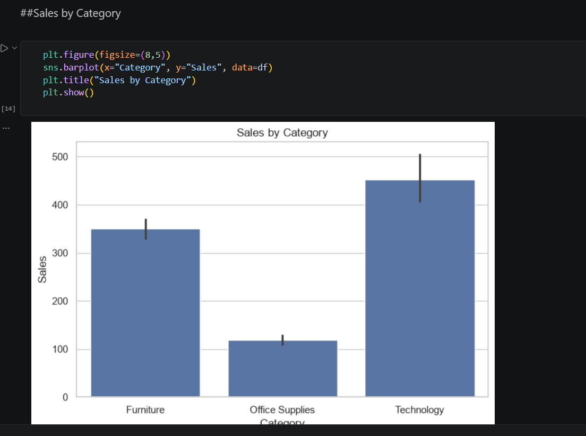
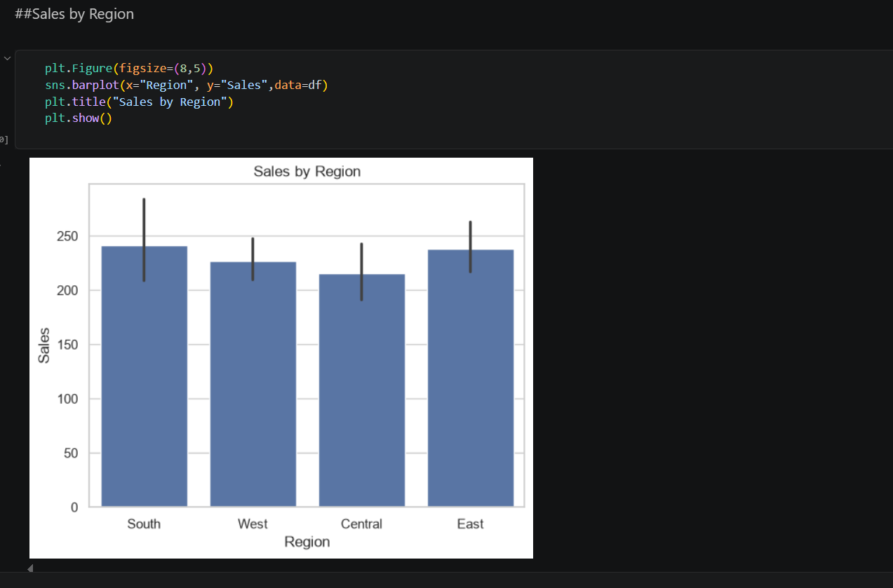
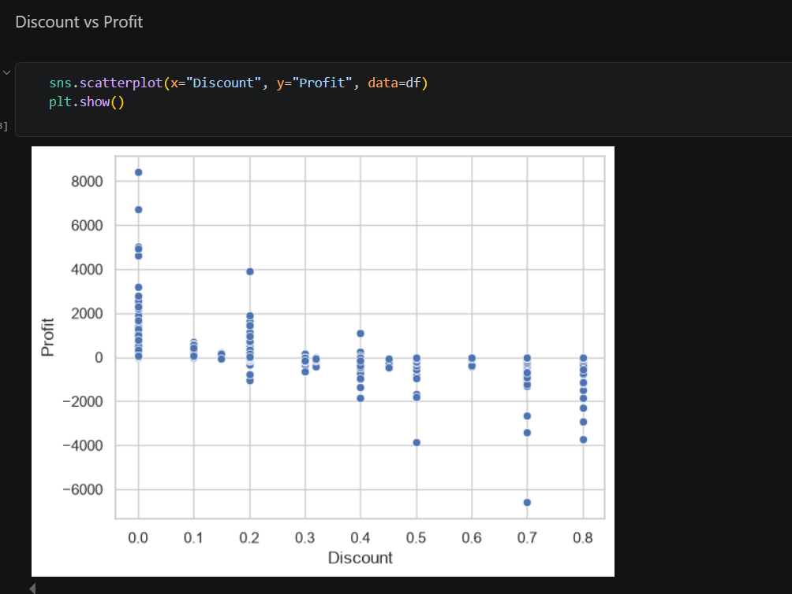
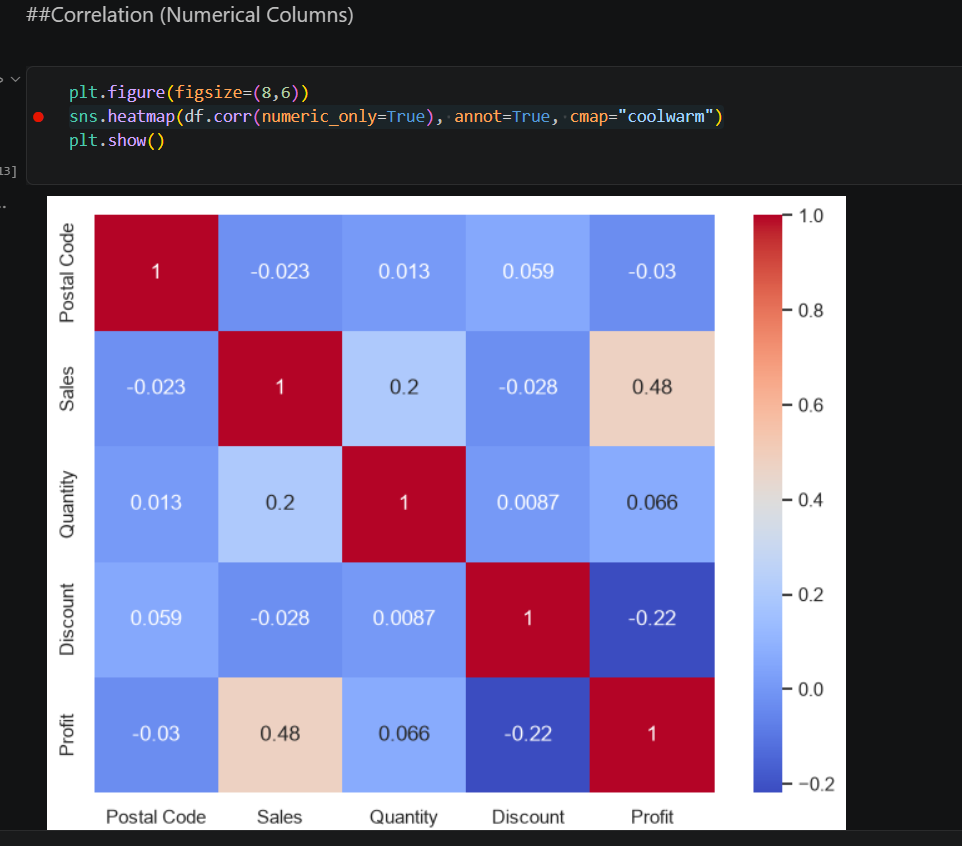
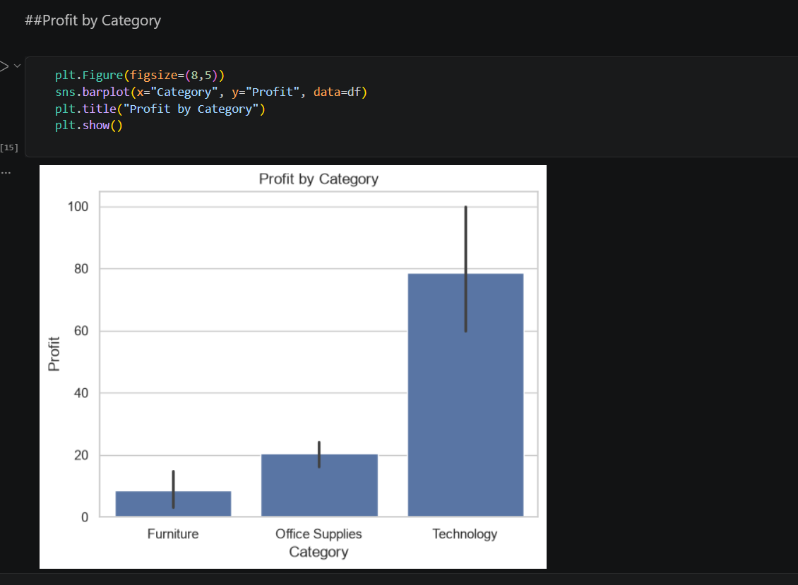

# 📊 Superstore Sales Analysis

## 📌 Project Overview

This project analyzes Superstore sales data using Python. The objective is to identify sales trends, profitable categories, regional performance, and the impact of discounts on profitability.

---

## 📂 Dataset

- Dataset Name: Sample Superstore
- Format: CSV
- Total Columns: 13
- Analysis Tool: Jupyter Notebook

---

## 🛠️ Tools Used

- Python
- Pandas
- NumPy
- Matplotlib
- Seaborn
- Jupyter Notebook

---

## 📊 Visualizations

The project includes:

- Sales by Category
- Profit by Category
- Sales by Region
- Sales by Segment
- Discount vs Profit
- Correlation Heatmap

---

## 💡 Business Insights

- Technology generated the highest sales.
- Office Supplies had the lowest profit margin.
- High discounts often resulted in negative profits.
- The West region achieved the highest revenue.
- Consumer segment contributed the most sales.

---

## 🚀 How to Run

1. Clone this repository

```bash
git clone https://github.com/Vaibhav-deulkar/superstore-sales-analysis.git
```

2. Install dependencies

```bash
pip install -r requirements.txt
```

3. Open the notebook

```bash
jupyter notebook
```

4. Run all cells.

---

## 📷 Screenshots

(Add screenshots of your charts here.)

---

## 👨‍💻 Author

**Vaibhav Deulkar**

GitHub:
https://github.com/Vaibhav-deulkar

## 📷 Screenshots

### Sales by Category



### Sales by Region



### Discount vs Profit



### Correlation Heatmap



### Profit by Category

